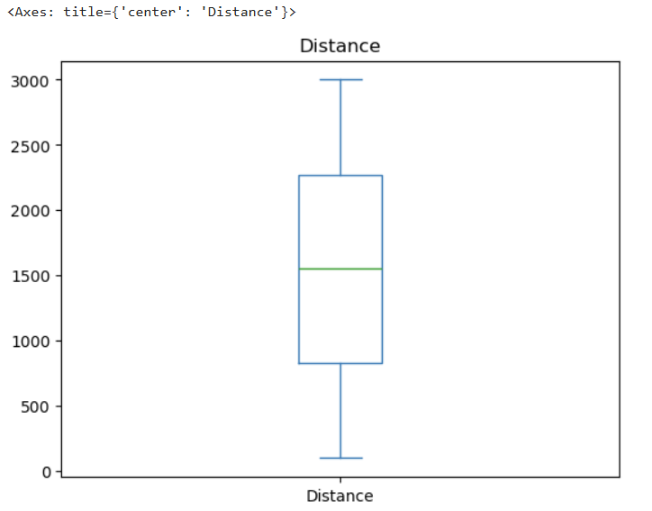
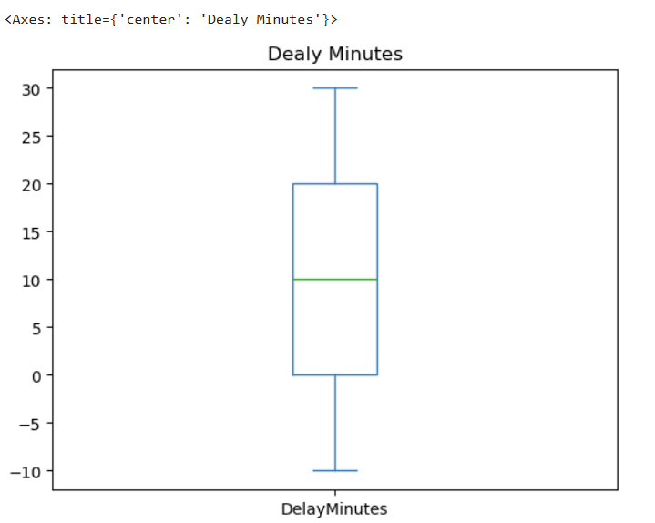
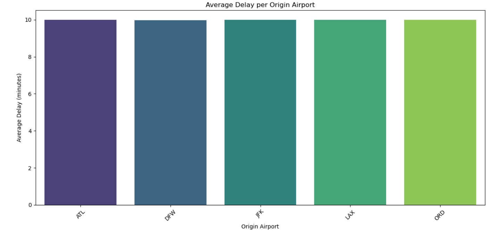
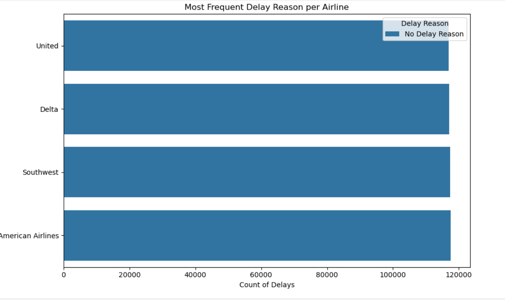
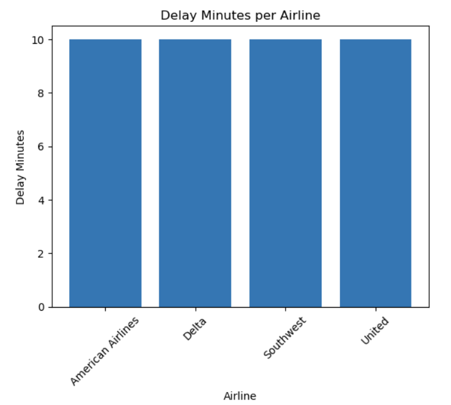
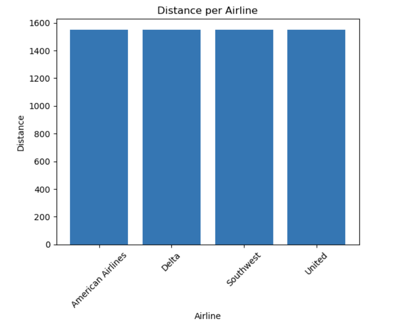
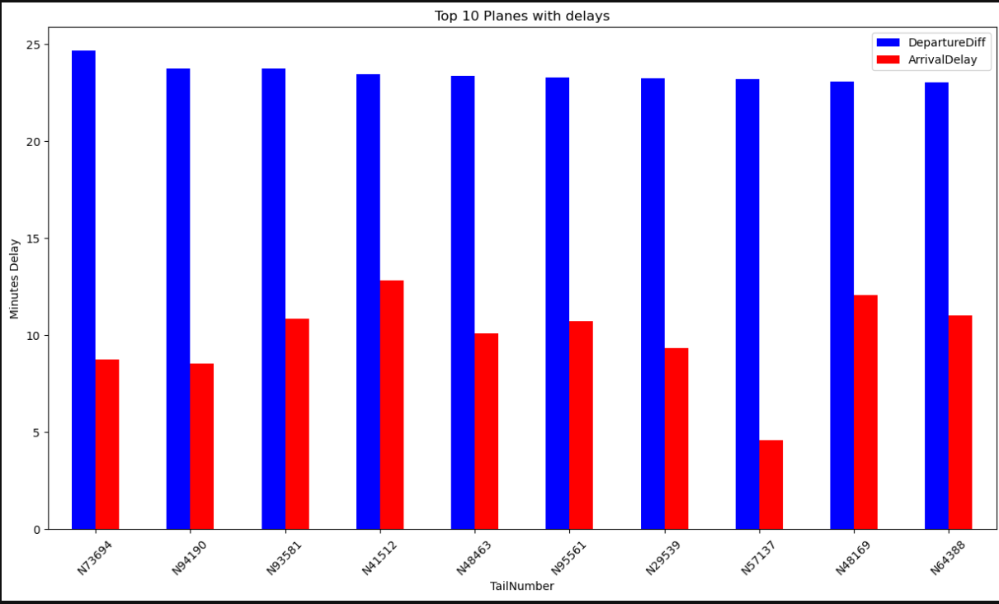
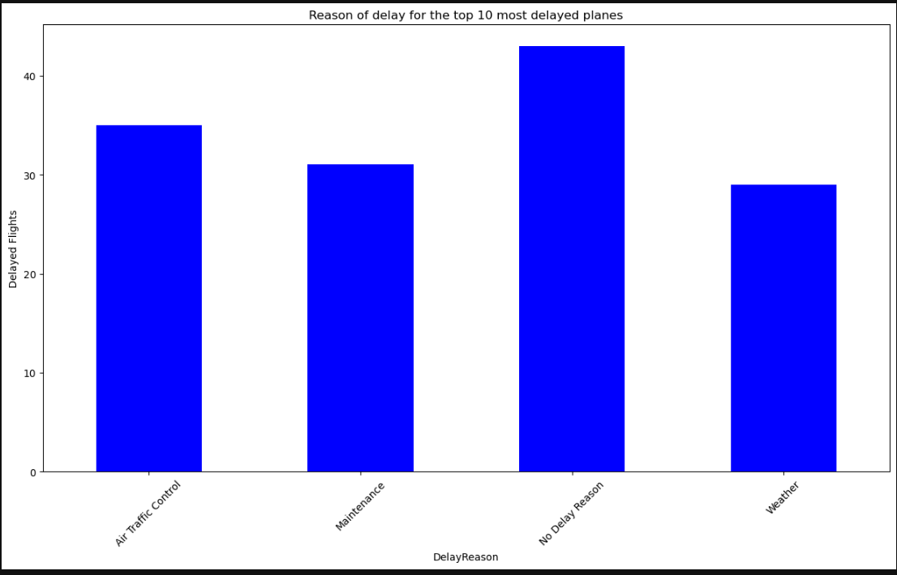
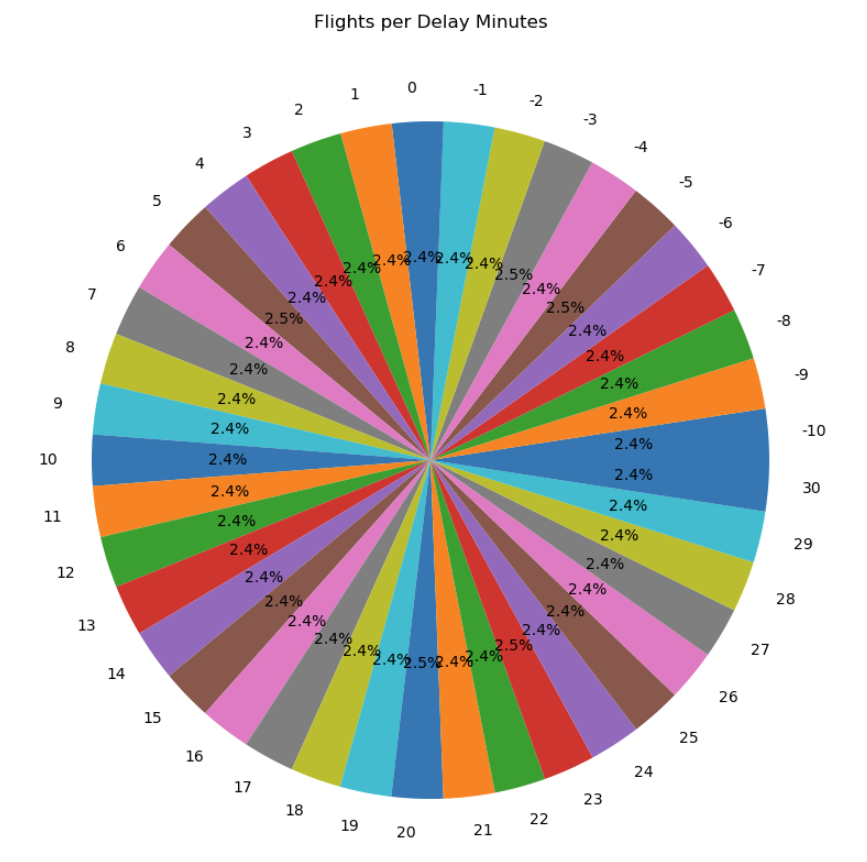

# Delay of flights and the reason behind it

Retrieve a dataset from kaggle regarding flight delays. 
Make various transformations and create plots 

---

## Table of Contents
- [Dataset](#Dataset)
- [Features](#features)
- [Plots](#Plots)
- [Contributing](#contributing)
---

## Dataset
The dataset used in this project is available on Kaggle:  
[Flight Delays Dataset](https://www.kaggle.com/datasets/umeradnaan/flight-delays-dataset)

It contains information about flight times, delays, airports, airlines, and delay reasons.

## Features
- Load and explore the dataset. 
- Clean the data: handle null values, correct datetimes, and create new datetime-related features. 
- Perform various transformations and aggregations to understand delays.  
- Generate multiple insightful plots to visualize patterns in delays.

---
## Plots

###  Distance

### Delay in Minutes

### Average Delay per Origin Airport

### Counts of Delay Reasons

### Most Frequent Delay Reason

### Average Delay Minutes by Airline

### Average Distance per Airline

### Delays per Plane

### Delay Reasons for Top 10 Planes

### Chart for min and max of delay minutes

---

## Contributing
- Marios Klouvatos
- Aggelos Mavraganis
- Thanasis Chatzieleftheriou

---
